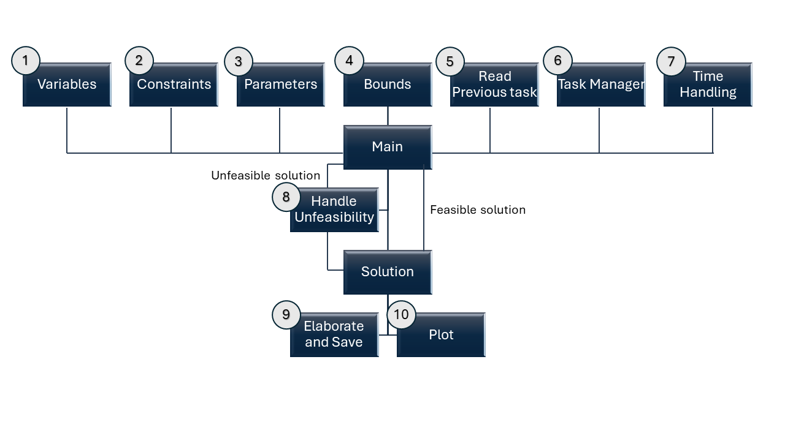

# Plot Results copy

This is the main file that runs the MIL optimization.
It is the file that is called by the user to run the optimization. 

To access the main function, you can follow this link:

<a href="https://github.com/fsartore/Schedule_MIL_optimization_pyomo/blob/main/Scheduling_task_multiyear.py" target="_blank" style="color: #4CAF50;">Scheduling_task_multiyear</a>

*Figure 1: Optimization Process Description*